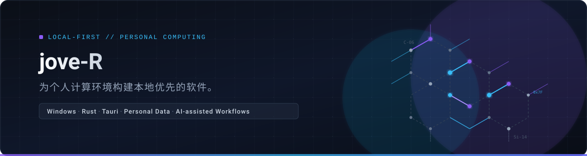

<picture>
  <source media="(prefers-color-scheme: dark)" srcset="assets/banner-dark.svg">
  <source media="(prefers-color-scheme: light)" srcset="assets/banner-light.svg">
  
</picture>

# jove-R

**Local-first software for personal computing.**  
为个人计算环境构建本地优先的软件。

Windows · Rust · Tauri · Personal Data · AI-assisted Workflows

[GitHub](https://github.com/rowanjove) &nbsp;·&nbsp; [X (Twitter)](https://x.com/rowanjove)

---

## Selected Work

### 🖋️ [INKREST](https://github.com/rowanjove/INKREST)
> **Local-first long-form writing workspace with multi-agent production, memory and quality control.**

- **Core Capabilities**: End-to-end long-form novel creation environment combining outline planning, persistent character/setting memory recall, automated chapter drafting, and pre-acceptance consistency checks (continuity, banned terms, and logic contradictions).
- **Architecture**: Modular workflow engine with isolated drafting and review stages, local SQLite storage, and extensible plugin boundaries.
- **Tech Stack**: `Python` · `FastAPI` · `Vue 3` · `Electron` · `SQLite`
- **Links**: [Source](https://github.com/rowanjove/INKREST) · [Releases](https://github.com/rowanjove/INKREST/releases)

---

### 🧭 [Browsory](https://github.com/rowanjove/Browsory)
> **Local-first browser history archive, search and personal analytics desktop app.**

- **Core Capabilities**: Incremental offline ingestion from Chromium and Firefox profiles, full-text indexing via SQLite FTS5, temporal browsing pattern analytics, and zero-telemetry local data ownership.
- **Architecture**: Rust/Tauri native backend with asynchronous profile readers, isolated WAL checkpoint handling, and responsive desktop frontend.
- **Tech Stack**: `Rust` · `Tauri` · `SQLite` · `FTS5` · `Windows Desktop`
- **Links**: [Source](https://github.com/rowanjove/Browsory) · [Releases](https://github.com/rowanjove/Browsory/releases)

---

### 🦆 [ProxyDuck](https://github.com/rowanjove/ProxyDuck)
> **Windows per-application network routing and diagnostic tool.**

- **Core Capabilities**: Granular per-process TCP/UDP/DNS routing into local SOCKS5 proxies without global system proxy pollution; includes real-time connection diagnostic logs and automated failover rules.
- **Architecture**: Lightweight Windows kernel/WFP driver integration paired with a dedicated background daemon and interactive desktop UI.
- **Tech Stack**: `Rust` · `Windows` · `Network` · `Desktop` · `CLI`
- **Links**: [Source](https://github.com/rowanjove/ProxyDuck) · [Releases](https://github.com/rowanjove/ProxyDuck/releases)

---

### 🕸️ [Loomark](https://github.com/rowanjove/Loomark)
> **Local research crawler and web archive for structured personal knowledge collection.**

- **Core Capabilities**: Dual-engine extraction pipeline combining `curl_cffi` for fast static HTTP requests and Playwright for JavaScript-heavy dynamic pages; includes scheduled site monitoring, snapshot diffing, and structured local indexing.
- **Architecture**: Decoupled task scheduler with configurable concurrency, rate limiting, and structured JSON/Markdown persistence.
- **Tech Stack**: `Python` · `Playwright` · `curl_cffi` · `Local-first`
- **Links**: [Source](https://github.com/rowanjove/Loomark) · [Releases](https://github.com/rowanjove/Loomark/releases)

---

## Small Tools

Focused utilities designed for specific friction points in daily personal computing.

| Tool | Purpose | Platform / Stack | Links |
|---|---|---|---|
| **[RunTelos](https://github.com/rowanjove/RunTelos)** | Lightweight Windows task launcher for scripts, batch files and local utilities | Windows · Rust · Desktop | [Source](https://github.com/rowanjove/RunTelos) · [Releases](https://github.com/rowanjove/RunTelos/releases) |
| **[Metaxy](https://github.com/rowanjove/Metaxy)** | Personal cross-device relay for temporary clipboard text and file transfer | Web · Cloudflare · TS | [Source](https://github.com/rowanjove/Metaxy) |
| **[StackHome](https://github.com/rowanjove/StackHome)** | Local file workspace for rule-based organization, deduplication and backup | Windows · Rust · Desktop | [Source](https://github.com/rowanjove/StackHome) · [Releases](https://github.com/rowanjove/StackHome/releases) |
| **[Orthos](https://github.com/rowanjove/Orthos)** | Offline configuration validator and fixer for JSON, YAML, TOML, XML, INI, ENV | CLI · Rust | [Source](https://github.com/rowanjove/Orthos) · [Releases](https://github.com/rowanjove/Orthos/releases) |
| **[LANDrop](https://github.com/rowanjove/LANDrop)** | Zero-configuration local network file and text transfer utility | Local Network · Go | [Source](https://github.com/rowanjove/LANDrop) |
| **[MarkClip](https://github.com/rowanjove/MarkClip)** | Browser extension converting web pages, selected areas, or articles into clean Markdown | Chrome Extension · JS | [Source](https://github.com/rowanjove/MarkClip) |
| **[Postcase-X](https://github.com/rowanjove/Postcase-X)** | Saves X (Twitter) posts, threads, and articles as structured Markdown with ZIP media archive | Chrome Extension · JS | [Source](https://github.com/rowanjove/Postcase-X) · [Web Store](https://chromewebstore.google.com/detail/x-markdown-exporter/alicknocngkldhijfocddaepnfpgjlee) |
| **[CF-Nexarch](https://github.com/rowanjove/CF-Nexarch)** | Local Windows console for Cloudflare Workers, DNS, and edge service management | Windows · Desktop | [Source](https://github.com/rowanjove/CF-Nexarch) |
| **[WebVault](https://github.com/rowanjove/WebVault)** | Local web archive and digital asset preservation tool | Local-first · Storage | [Source](https://github.com/rowanjove/WebVault) |

---

## Currently Building

Active focus areas under continuous iterative development:

- **[INKREST](https://github.com/rowanjove/INKREST)** — Long-form memory consistency, plugin ecosystem architecture, and automated editorial workflows.
- **[Browsory](https://github.com/rowanjove/Browsory)** — Unified multi-browser schema migration, FTS5 query optimization, and offline personal analytics.
- **[Loomark](https://github.com/rowanjove/Loomark)** — Incremental crawl policies, structured schema extractors, and automated task recovery.

---

## Principles

- **Local-first**: Personal data remains strictly on local storage in transparent, non-proprietary formats (SQLite, Markdown, JSON).
- **Useful before intelligent**: Reliable software engineering takes precedence over hype; AI serves as an augmentation layer rather than a gimmick.
- **Small tools, clear purpose**: Clean boundaries, single responsibilities, and straightforward solving of concrete personal computing problems.
- **Maintenance depth > Repository count**: Prioritize long-term polish, stability, test coverage, and documentation over publishing high volumes of transient repositories.

---

<b>Labs & Experiments (探索性原型)</b>

 

Exploratory prototypes and early concept verifications:

- **[WOL](https://github.com/rowanjove/WOL)** — Web-based random life simulation and destiny wheel experiment.
- **[Worldara](https://github.com/rowanjove/Worldara)** — Worldbuilding and lore management tool for long-form narrative design.
- **[PanNexus](https://github.com/rowanjove/PanNexus)** — Multi-source federation and resource aggregation search prototype.
- **[MediaFlow](https://github.com/rowanjove/MediaFlow)** — Lightweight multi-platform media stream parser and downloader.
- **[Pixkin](https://github.com/rowanjove/Pixkin)** — AI desktop companion prototype with character incubation and state management.
- **[Personal-Site-Matrix](https://github.com/rowanjove/Personal-Site-Matrix)** — 21 static website templates for personal profiles, blogs, and link trees.

---

## Elsewhere

- **GitHub**: [@rowanjove](https://github.com/rowanjove)
- **X (Twitter)**: [@rowanjove](https://x.com/rowanjove)
